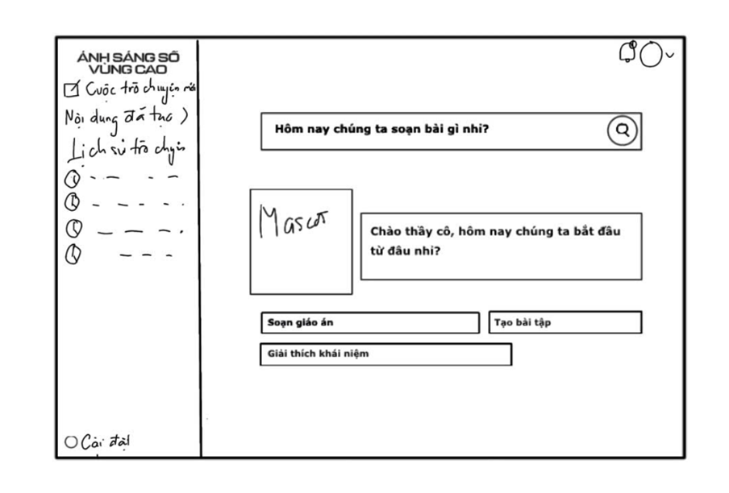
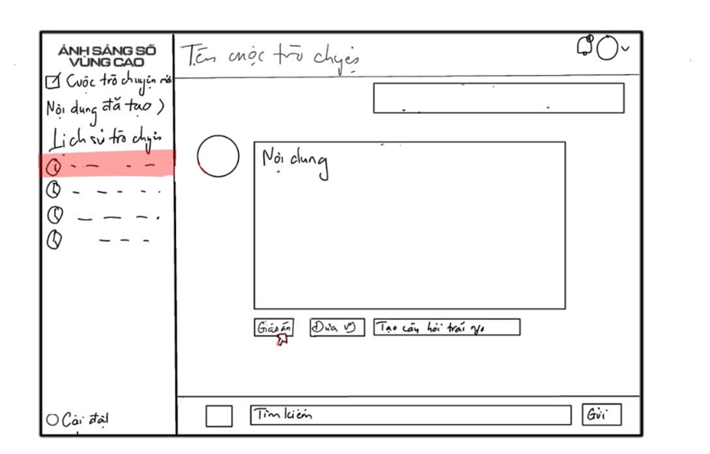
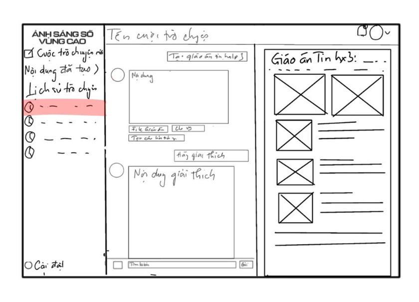
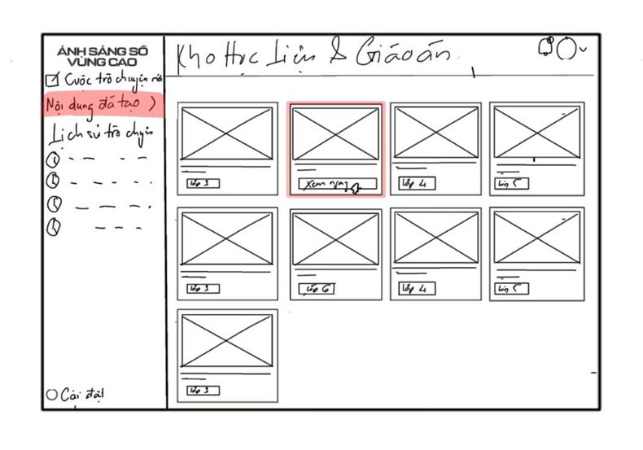

# SCREEN 1 - TRANG CHỦ

Lưu ý về thiết kế:

Góc trái trên cùng: Logo viettel + typo chữ TELI

Mascot: QTDA | ÁNH SÁNG SỐ VÙNG CAO

Sử dụng một trong những hình này

Nội dung - cột Lịch sử cuộc trò chuyện:

- Soạn bài: Chuột máy tính lớp 4
- Hoạt động thực hành Paint lớp 4
- Bài giảng PowerPoint: Chuột máy tính lớp 3
- Hoạt động thực hành: Nhận biết bàn phím lớp 3
- Cách giải thích Internet cho học sinh lớp 4
- Soạn slide: Thư mục và tệp tin lớp 5
- Bài giảng: Cách gõ bàn phím 10 ngón lớp 5
- Ví dụ dễ hiểu về mạng Internet lớp 5

# SCREEN 2 - NHẬP LIỆU

Lưu ý thiết kế:

Sử dụng hình này cho Avatar của TELI

Nội dung:

Tên cuộc trò chuyện: Soạn bài: Chuột máy tính lớp 4

## Input dữ liệu

Tôi đang dạy Tin học lớp 4. Dựa vào giáo trình Tin học của Bộ giáo dục & đào tại, hãy giúp tôi soạn nội dung bài giảng về chuột máy tính cho học sinh.

Bài giảng cần:

- Giải thích đơn giản, dễ hiểu cho học sinh tiểu học
- Giới thiệu các bộ phận chính của chuột máy tính
- Các thao tác cơ bản như: nhấp chuột, nhấp đúp, kéo thả
- Gợi ý một hoạt động thực hành ngắn cho học sinh trong lớp.

Trình bày dưới dạng bullet để tôi có thể đưa vào slide bài giảng:

## Output (phản hồi của TELI)

Dưới đây là nội dung bài giảng gợi ý cho bài học: Chuột máy tính – Tin học lớp 4.

### 1. Chuột máy tính là gì?

Chuột máy tính là thiết bị giúp chúng ta điều khiển con trỏ trên màn hình để mở chương trình, chọn biểu tượng hoặc thực hiện các thao tác trên máy tính.

Giáo viên có thể giải thích cho học sinh:

“Chuột máy tính giống như tay của chúng ta khi làm việc với máy tính.”

### 2. Các bộ phận chính của chuột máy tính

Giới thiệu cho học sinh 3 bộ phận cơ bản:

- Nút chuột trái: dùng để chọn hoặc mở chương trình
- Nút chuột phải: dùng để mở các lựa chọn khác
- Con lăn chuột (scroll wheel): dùng để cuộn lên xuống trang

Gợi ý: giáo viên có thể giơ chuột thật để học sinh quan sát trực tiếp.

### 3. Các thao tác chuột cơ bản

Nhấp chuột (Click):

Bấm nhanh nút chuột trái một lần.

Nhấp đúp (Double Click):

Bấm nhanh nút chuột trái hai lần liên tiếp để mở chương trình.

Kéo thả (Drag and Drop):

Giữ nút chuột trái, di chuyển chuột, sau đó thả ra.

### 4. Hoạt động thực hành gợi ý

Hoạt động: “Tìm biểu tượng trên màn hình”

Bước 1: Giáo viên yêu cầu học sinh mở máy tính.

Bước 2: Học sinh dùng chuột để nhấp vào một biểu tượng bất kỳ trên màn hình.

Bước 3: Thực hành nhấp đúp để mở phần mềm Paint.

Bước 4: Thử kéo thả cửa sổ phần mềm sang vị trí khác.

Thời gian hoạt động: 5–7 phút.

### 5. Câu hỏi kiểm tra nhanh

- Chuột máy tính dùng để làm gì?
- Nút chuột trái dùng để làm gì?
- Khi nào chúng ta dùng thao tác nhấp đúp?

Nếu cần, TELI có thể:

- Tạo slide bài giảng PowerPoint cho bài học này
- Gợi ý bài tập thực hành cho học sinh lớp 4
- Tạo bài kiểm tra nhanh 5 câu hỏi cho cuối tiết học

# SCREEN 3 - XỬ LÝ

## Input

Tôi là giáo viên môn Tin học và đang soạn giáo án Tin học lớp 4. Hãy tạo cho tôi file giáo trình Bài 1: Tìm kiếm thông tin trên Internet - nằm trong Chủ đề: Tổ chức lưu trữ, tìm kiếm và trao đổi thông tin.

## Output

TELI đang tạo giáo trình…

### Giáo trình gợi ý

Môn: Tin học lớp 4

Chủ đề: Tổ chức lưu trữ, tìm kiếm và trao đổi thông tin

Bài 1: Tìm kiếm thông tin trên Internet

### 1. Mục tiêu bài học

Sau bài học, học sinh có thể:

- Hiểu được Internet là nguồn thông tin lớn giúp tìm kiếm kiến thức.
- Biết cách tìm kiếm thông tin đơn giản trên Internet.
- Nhận biết được một số quy tắc cơ bản khi sử dụng Internet an toàn.

### 2. Kiến thức trọng tâm

Internet là gì?

Internet là mạng kết nối nhiều máy tính trên toàn thế giới, giúp chúng ta tìm kiếm thông tin, học tập và trao đổi với nhau.

Ví dụ dễ hiểu cho học sinh:

Internet giống như một thư viện rất lớn, nơi chúng ta có thể tìm thấy nhiều thông tin khác nhau.

### 3. Các bước tìm kiếm thông tin

- Bước 1: Mở trình duyệt Internet (Chrome, Edge, hoặc Cốc Cốc).
- Bước 2: Nhập nội dung cần tìm vào ô tìm kiếm.
- Bước 3: Nhấn Enter để xem kết quả.
- Bước 4: Chọn trang web phù hợp để đọc thông tin.

### 4. Ví dụ tìm kiếm

Giáo viên hướng dẫn học sinh tìm kiếm:

“Động vật sống trong rừng”

“Các hành tinh trong hệ mặt trời”

“Thủ đô của Việt Nam”

### 5. Lưu ý khi sử dụng Internet

- Không nhấp vào các trang web lạ.
- Không chia sẻ thông tin cá nhân trên mạng.
- Luôn hỏi giáo viên hoặc người lớn khi gặp nội dung không hiểu.

### 6. Hoạt động thực hành

Hoạt động: Tìm thông tin về một loài động vật.

Bước 1: Học sinh mở trình duyệt Internet.

Bước 2: Tìm kiếm thông tin về một con vật yêu thích.

Bước 3: Ghi lại 2–3 thông tin thú vị về con vật đó.

File giáo trình đã sẵn sàng để tải về:

- Slide bài giảng
- Nội dung giáo án
- Bài tập thực hành cho học sinh

TELI có thể hỗ trợ thêm cho bài học này:

- Tạo bài kiểm tra nhanh 5 câu hỏi cho cuối tiết học
- Gợi ý hoạt động tương tác cho lớp học vùng cao
- Tạo slide bài giảng đơn giản phù hợp với học sinh lớp 4
- Thiết kế phiếu bài tập in ra cho học sinh

## Input

Gợi ý thêm về hoạt động tương tác cho các em học sinh cho phù hợp với bài học này

## Output

TELI gợi ý một số hoạt động tương tác phù hợp với lớp học Tin học vùng cao, giúp học sinh dễ tiếp cận công nghệ:

### 1. Trò chơi “Ai tìm nhanh hơn”

Giáo viên chia lớp thành các nhóm nhỏ.

Nhiệm vụ:

Mỗi nhóm tìm một thông tin đơn giản trên Internet, ví dụ:

- Tìm hình ảnh con voi
- Tìm thủ đô của Việt Nam
- Tìm một loại trái cây

Nhóm tìm được thông tin đúng và nhanh nhất sẽ được điểm thưởng.

### 2. Hoạt động “Khám phá Internet”

Giáo viên chuẩn bị sẵn một số câu hỏi:

- Việt Nam có bao nhiêu tỉnh thành?
- Con vật nào lớn nhất trên cạn?
- Trái đất quay quanh cái gì?

Học sinh sử dụng máy tính để tìm câu trả lời trên Internet.

### 3. Hoạt động “Chia sẻ điều em tìm được”

Sau khi tìm kiếm thông tin, mỗi học sinh:

- Nói 1 điều thú vị mình tìm được
- Chia sẻ với cả lớp

Hoạt động này giúp học sinh tăng khả năng giao tiếp và ghi nhớ kiến thức.

### 4. Hoạt động “Internet an toàn”

Giáo viên đưa ra các tình huống:

- Một trang web yêu cầu nhập tên và địa chỉ
- Một đường link lạ xuất hiện

Học sinh sẽ thảo luận và chọn:

Nên làm / Không nên làm

Hoạt động này giúp học sinh hình thành thói quen sử dụng Internet an toàn ngay từ nhỏ.

TELI có thể hỗ trợ thêm:

- Tạo trò chơi ô chữ về Internet cho học sinh
- Tạo câu hỏi trắc nghiệm tương tác
- Gợi ý hoạt động nhóm phù hợp với lớp học ít thiết bị
- Thiết kế phiếu bài tập thực hành cho học sinh

# SCREEN 4 - KẾT QUẢ

- Giáo án - Bài học: Tôn trọng quyền tác giả của phần mềm  
  Lớp 4

- Slide - Bài 4: Trình bày thông tin ở dạng bảng  
  Lớp 6

- Tổng hợp - Chủ đề C: Đạo đức, pháp luật và văn hóa trong môi trường số  
  Lớp 6

- Giáo án - Sự cần thiết của sắp xếp  
  Lớp 3

- Slide - Bài 3: Em tập làm người chỉ huy giỏi  
  Lớp 3

- Tổng hợp - Chủ đề E1: Làm quen với bài trình chiếu đơn giản  
  Lớp 3

- Slide - Sử dụng website YouTube Kids  
  Lớp 5

- Slide - Bài 1: Thực hành tạo cây thư mục  
  Lớp 5
