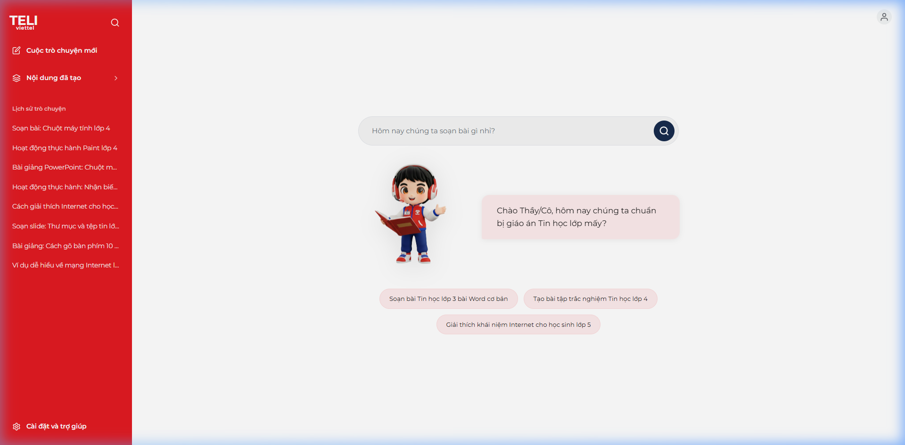
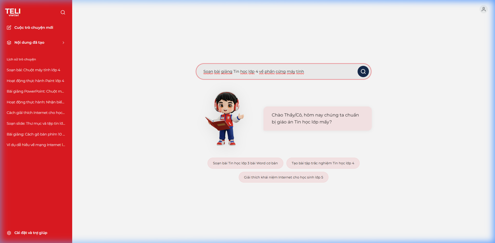
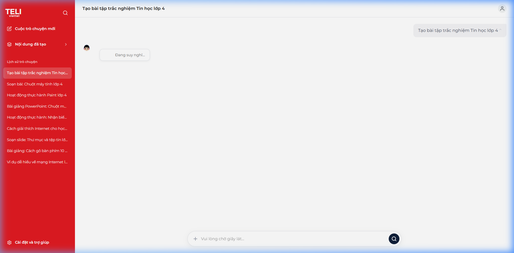
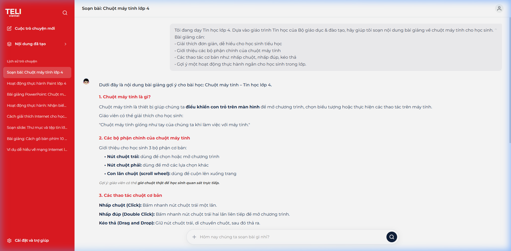
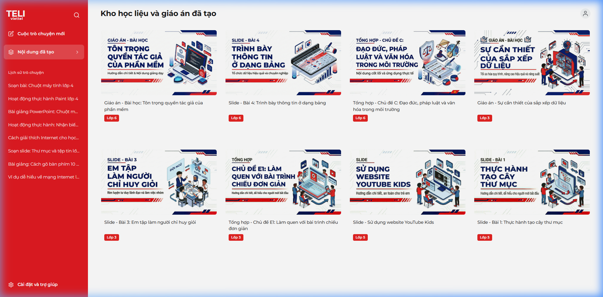
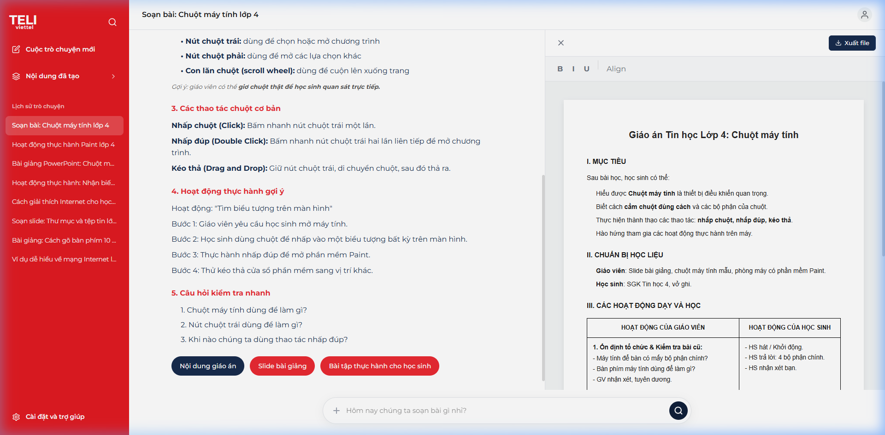

# Hướng dẫn sử dụng TELI Viettel - Trợ lý Giáo án số

Chào mừng Thầy/Cô đến với **TELI Viettel**, nền tảng hỗ trợ giáo viên soạn thảo giáo án và bài giảng môn Tin học một cách thông minh và hiệu quả. Dưới đây là các bước hướng dẫn chi tiết để Thầy/Cô làm chủ công cụ này.

---

## 1. Khởi tạo ý tưởng từ Trang chủ

Ngay khi truy cập vào hệ thống, Thầy/Cô sẽ thấy giao diện trang chủ thân thiện với biểu tượng chú robot TELI.

- **Cách thức**: Nhập chủ đề bài giảng hoặc yêu cầu vào ô tìm kiếm chính giữa màn hình.
- **Gợi ý**: Thầy/Cô có thể nhấp vào các thẻ gợi ý có sẵn như _"Soạn bài Tin học lớp 3 bài Word cơ bản"_ để bắt đầu nhanh.

_Giao diện trang chủ với thanh tìm kiếm thông minh._

---

## 2. Gửi yêu cầu soạn bài

Sau khi nhập nội dung yêu cầu, hãy nhấn **Enter** hoặc nhấp vào biểu tượng kính lúp để gửi yêu cầu.

_Thầy/Cô có thể nhập chi tiết khối lớp và chủ đề muốn soạn._

---

## 3. Chờ TELI xử lý và phản hồi

Hệ thống sẽ tự động chuyển sang giao diện hội thoại. Tại đây, TELI sẽ hiển thị trạng thái **"Đang suy nghĩ..."** kèm biểu tượng mascot để Thầy/Cô biết yêu cầu đang được xử lý.

_TELI đang phân tích giáo trình để đưa ra nội dung phù hợp nhất._

---

## 4. Xem và tương tác với kết quả

Khi AI trả về nội dung, Thầy/Cô có thể xem các phần chính của giáo án ngay trong khung chat. Thầy/Cô có thể yêu cầu sửa đổi hoặc bổ sung thêm các tính năng như Slide bài giảng, Bài tập thực hành,... qua các nút hành động phía dưới.

_Nội dung giáo án chi tiết và các phím tắt hành động nhanh._

---

## 5. Quản lý kho học liệu cá nhân

Mọi phiên hội thoại và giáo án bạn đã tạo sẽ được lưu lại tự động. Thầy/Cô có thể truy cập vào mục **"Nội dung đã tạo"** ở Sidebar bên trái để xem lại toàn bộ kho tàng học liệu của mình.

_Danh sách các bài giảng và giáo án đã được hệ thống hóa đẹp mắt._

---

## 6. Quản lý nội dung chi tiết và Xuất giáo án (Word)

Đây là tính năng quan trọng nhất giúp Thầy/Cô có được bản thảo giáo án hoàn chỉnh để sử dụng trên lớp.

- **Xem giáo án chi tiết**: Trong khung chat, nhấp vào nút **"Nội dung giáo án"**. Một bảng soạn thảo (Editor) sẽ hiện ra ở phía bên phải màn hình.
- **Chỉnh sửa**: Giao diện soạn thảo này hoạt động tương tự như Microsoft Word, cho phép Thầy/Cô định dạng văn bản (In đậm, in nghiêng, căn lề,...) và bảng biểu.
- **Xuất file**: Khi đã hài lòng với nội dung, Thầy/Cô chỉ cần nhấn nút **"Xuất file"** ở góc trên cùng bên phải của trình soạn thảo để tải giáo án về máy tính.

_Giao diện vừa chat vừa soạn thảo giáo án song song cực kỳ tiện lợi._

---

**Chúc Thầy/Cô có những giờ lên lớp thật bùng nổ cùng TELI Viettel!**
